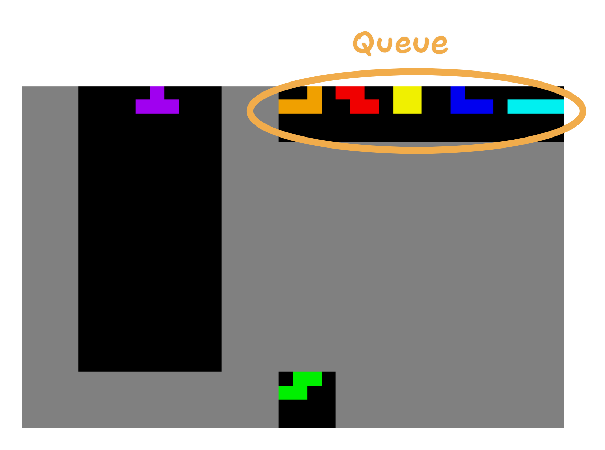

# Queue



```{eval-rst}
.. autoclass:: tetris_gymnasium.components.tetromino_queue.TetrominoQueue
```

## Methods
```{eval-rst}
.. automethod:: tetris_gymnasium.components.tetromino_queue.TetrominoQueue.reset
.. automethod:: tetris_gymnasium.components.tetromino_queue.TetrominoQueue.get_next_tetromino
.. automethod:: tetris_gymnasium.components.tetromino_queue.TetrominoQueue.get_queue
```
