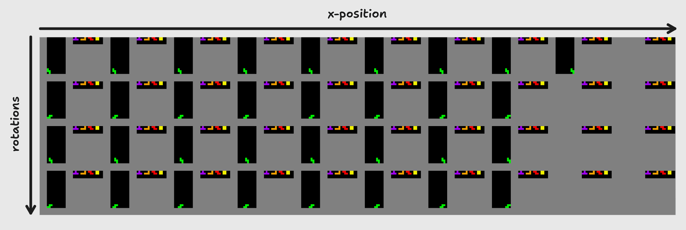

# Wrappers

Wrappers are used to extend or alter the functionality of an environment.
You can easily define your own observation wrappers by following the [Gymnasium documentation for wrappers](https://gymnasium.farama.org/api/wrappers/).
Alternatively, you can use predefined wrappers from Tetris Gymnasium or Gymnasium.

## Grouped actions

The grouped actions wrapper is a special wrapper that changes both the action space and the observation space of the environment.
Instead of offering actions such as moving the Tetromino by one position, the grouped actions wrapper offers actions that place the Tetromino in a specific position.



This image is used for demonstration purpose only. The real observation is an array as described in the _Observation Space_ section,
which can be interpreted as a flattened (1D) version of this image.

```{eval-rst}
.. autoclass:: tetris_gymnasium.wrappers.grouped.GroupedActionsObservations
```

## Observation wrappers

Observation wrappers are used to alter the observation space of the environment. This can be useful for changing the
shape of the observation space or for adding additional information to the observation space.

### RGB


```{eval-rst}
.. autoclass:: tetris_gymnasium.wrappers.observation.RgbObservation
```

### Feature vectors

```{eval-rst}
.. autoclass:: tetris_gymnasium.wrappers.observation.FeatureVectorObservation
```

## Action wrappers

Action wrappers are used to alter the observation space of the environment. At this stage, no
action wrappers are implemented in Tetris Gymnasium.
